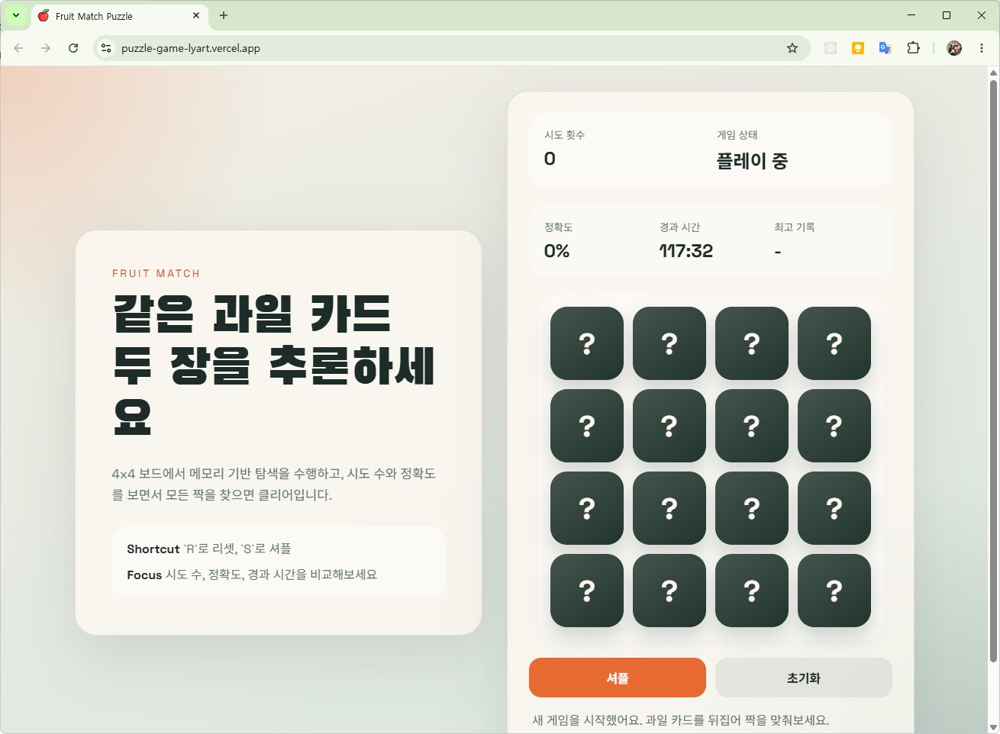

# puzzle-game

과일 카드의 짝을 맞추는 간단한 퍼즐 게임입니다.

## 카드 데이터는 어떻게 만들어질까?

이 게임의 카드는 아주 쉽게 말하면, **과일 그림 8개를 복사해서 16장 카드로 만들고, 그 카드를 랜덤으로 섞어서** 만들어집니다.

핵심 파일은 다음과 같습니다.

- `js/utils.js`: 과일 목록과 게임 상태가 들어 있습니다.
- `js/game.js`: 카드를 만들고 섞고, 게임을 시작합니다.
- `js/board.js`: 만들어진 카드 데이터를 화면에 그립니다.

## 1. 과일 목록이 먼저 있어요

`js/utils.js`에는 과일 목록이 있습니다.

```js
const fruits = ["...", "...", "...", "...", "...", "...", "...", "..."];
```

현재 코드를 보면 글자가 깨져 보일 수 있지만, 구조상 서로 다른 과일 8개가 들어 있습니다.

초등학생에게 설명하듯 말하면:

> 과일 스티커 8개가 들어있는 상자가 하나 있는 거예요.

## 2. 과일을 두 번 복사해서 짝을 만들어요

`js/game.js`의 `createShuffledBoard()` 함수에서 카드가 만들어집니다.

```js
const duplicatedFruits = [...fruits, ...fruits];
```

이 코드는 과일 목록을 한 번 더 복사합니다.

예를 들어 원래 과일이 이렇게 있었다면:

```js
["사과", "바나나", "포도"]
```

이렇게 바뀝니다.

```js
["사과", "바나나", "포도", "사과", "바나나", "포도"]
```

즉, 같은 과일이 2개씩 생기기 때문에 짝 맞추기 게임을 할 수 있습니다.

## 3. 과일 하나하나를 카드 데이터로 바꿔요

과일 이름만 있던 것을 카드 모양의 데이터로 바꿉니다.

```js
{
  id: `${fruit}-${index}`,
  fruit,
  revealed: false,
  matched: false
}
```

카드 한 장은 이런 정보를 가집니다.

```js
{
  id: "사과-0",
  fruit: "사과",
  revealed: false,
  matched: false
}
```

각 값의 뜻은 다음과 같습니다.

- `id`: 카드의 이름표입니다. 예를 들면 `"사과-0"` 같은 값입니다.
- `fruit`: 이 카드 안에 들어있는 과일입니다.
- `revealed`: 카드가 지금 뒤집혀서 보이는지 알려줍니다. 처음에는 `false`입니다.
- `matched`: 짝을 맞췄는지 알려줍니다. 처음에는 `false`입니다.

쉽게 말하면:

> 카드마다 작은 이름표를 붙이고,
> "나는 사과야",
> "나는 아직 안 뒤집혔어",
> "나는 아직 짝을 못 찾았어"
> 라고 적어두는 것입니다.

## 4. 카드를 랜덤으로 섞어요

카드가 만들어진 뒤에는 순서를 섞습니다.

```js
const random = createSeededRandom(state.seed);
```

그리고 반복문으로 카드 위치를 서로 바꿉니다.

```js
for (let index = shuffled.length - 1; index > 0; index -= 1) {
  const randomIndex = Math.floor(random() * (index + 1));
  [shuffled[index], shuffled[randomIndex]] = [shuffled[randomIndex], shuffled[index]];
}
```

쉽게 말하면:

> 책상 위에 카드 16장을 쫙 놓고,
> 여기 카드랑 저기 카드를 계속 바꿔가며 섞는 거예요.

## 5. 완성된 카드 묶음을 `state.board`에 저장해요

게임을 새로 시작할 때 `beginGame()` 함수가 실행됩니다.

```js
state.board = createShuffledBoard();
```

이 코드는 새로 만든 카드 16장을 현재 게임판에 넣습니다.

여기서 `state.board`가 현재 게임판의 카드 데이터입니다.

## 6. 화면에는 `state.board`를 보고 버튼을 만들어요

`js/board.js`의 `renderBoard()` 함수가 화면을 그립니다.

```js
state.board.forEach((card, index) => {
  const button = document.createElement("button");
});
```

카드 데이터 하나마다 버튼 하나를 만듭니다.

그리고 이 코드가 카드 앞면과 뒷면을 결정합니다.

```js
button.textContent = card.revealed || card.matched ? card.fruit : "?";
```

뜻은 다음과 같습니다.

- 카드가 뒤집혔거나 이미 맞춘 카드면 과일을 보여줍니다.
- 아직 숨겨진 카드면 `?`를 보여줍니다.

즉 화면에 보이는 카드는 버튼이고, 그 버튼은 `state.board` 안의 카드 데이터를 보고 모양을 바꿉니다.

## 실행화면



## 한 줄 정리

`fruits` 과일 8개를 두 벌로 복사해서 16장 카드로 만들고, 각 카드에 "과일, 뒤집혔는지, 맞췄는지" 정보를 붙인 다음, 랜덤으로 섞어서 `state.board`에 저장합니다. 화면은 이 `state.board`를 보고 카드 버튼을 그립니다.
